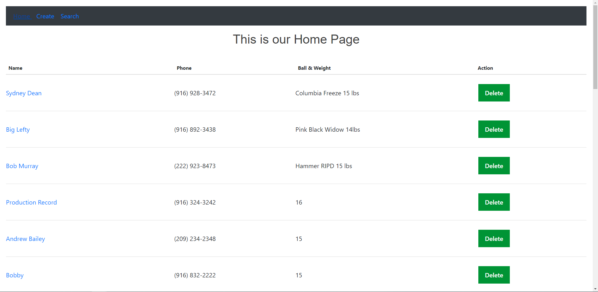
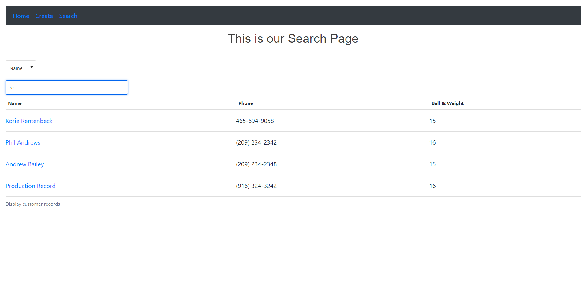
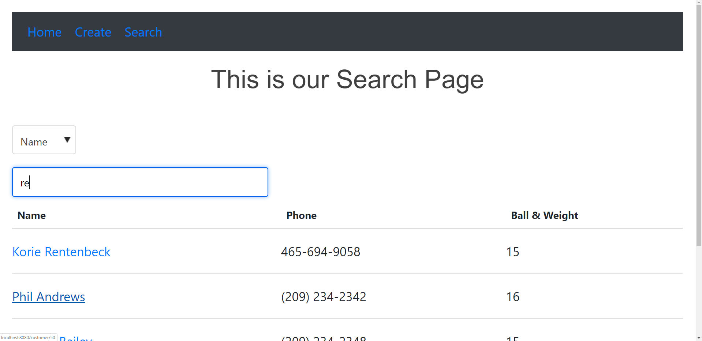

# Franks app

This app creates, updates, and searches for customers of a bowling shop.  Their name, phone, bowling ball infor, and mesaurements will be saved.

## Table of Contents
```
npm install
```
## Screenshots


<br>





### Running Locally
```
npm run serve
```

### Tech Stack
```
npm run build
```

### Lints and fixes files
```
npm run lint
```

### Customize configuration
See [Configuration Reference](https://cli.vuejs.org/config/).
"# FranksRecords" 
