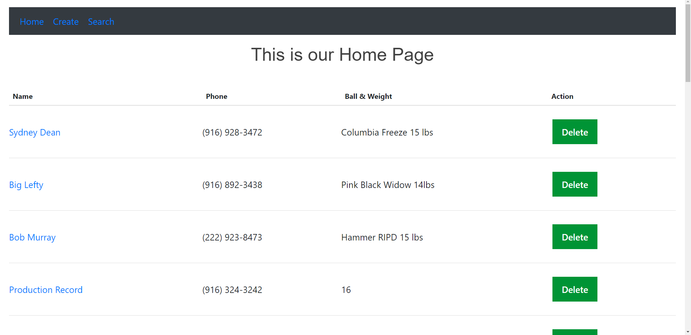

# Franks app

This app creates, updates, and searches for customers of a bowling shop.  The customer's name, phone, bowling ball information, and mesaurements will be saved.  The home page will show the last 10 recently created records.  In the search method after a record has been found the user can click on the customer name and will be directed to a page with notes and saved measurements with the ability to edit the notes and measurements.

## Table of Contents
```
npm install
```
## Screenshots




### Running Locally
```
npm run serve
```

### Tech Stack
```
npm run build
```

### Lints and fixes files
```
npm run lint
```

### Customize configuration
See [Configuration Reference](https://cli.vuejs.org/config/).
"# FranksRecords" 
